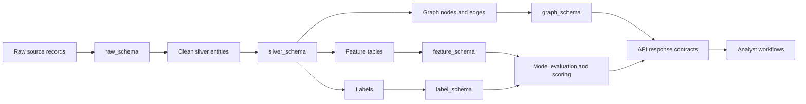

# Data Flow

SupplyRiskAtlas data moves through contract-governed stages so that risk scores and graph explanations remain traceable.

## Flow

## Contract Stages

| Stage | Contract path | Gate |
| --- | --- | --- |
| Raw ingest | `data_contracts/raw_schema/` | Required source identifiers, ingestion timestamp, source provenance |
| Silver normalization | `data_contracts/silver_schema/` | Canonical entity keys, deduplication rules, normalized geography and sector fields |
| Feature generation | `data_contracts/feature_schema/` | Feature names, types, null policy, training-serving parity |
| Label creation | `data_contracts/label_schema/` | Label definitions, horizon, censoring policy, leakage review |
| Graph materialization | `data_contracts/graph_schema/` | Node and edge types, required identifiers, temporal validity, provenance |
| API exposure | `packages/shared-types/`, `packages/api-client/` | Response shape, pagination, error semantics, backwards compatibility |

## Lineage Requirements

Every risk signal should be traceable to:

- Source dataset or event feed.
- Contract version used for validation.
- Transformation or feature pipeline version.
- Graph build or model evaluation run.
- API response field and UI surface where the signal appears.

## Data Quality Rules

- Entity identifiers must be stable across raw, silver, graph, and API stages.
- Time-dependent features must carry an effective timestamp and must not use future information.
- Model labels must document horizon, target definition, and exclusion rules.
- Graph edges must include source, target, edge type, validity window, and provenance.
- API responses must not expose internal-only fields unless documented as public contract fields.

## Failure Handling

- Contract validation failures block promotion to the next stage.
- Missing optional fields may pass only when a documented null policy exists.
- Leakage failures block model promotion and require an updated leakage test.
- Graph invariant failures block API exposure of affected graph views.

Related docs: [architecture overview](../architecture/overview.md), [quality gates](../quality-gates.md).
